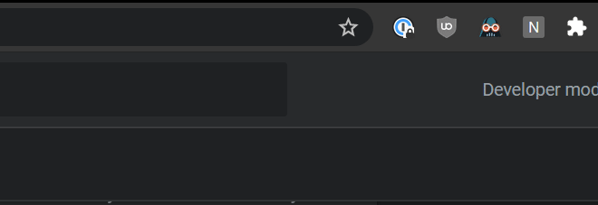

# NetGoLynx Browser Extension

A browser extension for handling go/ link redirects when DNS redirection isn't an option.

* 
  * [Chrome Install Page](https://chrome.google.com/webstore/detail/netgolynx/mklkfomkjepmekcdknkpcnfmjhlcgjjf?hl=en-US)

## What?

If you haven't seen [NetGoLynx](https://github.com/Cellivar/NetGoLynx) yet you should start there.

URL shorteners referred to as go/links all suffer from a central requirement: the address http://go must resolve. You'll note that addres is specifically HTTP, not HTTPS. This is because TLS certificiates for addresses that don't have a TLD are, near as I can tell, not valid. In testing I've been unable to generate a self-signed certificate for such a domain, or at least not one that would be reliably accepted by all browsers. Thus you need both to make sure the DNS entry `go.yourdomain.site` resolves, `yourdomain.site` is your DNS search domain configured on your computer, and then your browser will make a non-HTTPS connection to the site to then be redirected somewhere else.

What we really need is to skip the DNS part entirely and simply rewrite the URL at the browser. Enter this extension.

## How does it work?

Once you configure a NetGoLynx server by clicking on the icon and entering your server's URL it will intercept requests to go/whatever and rewrite the URL request to the server's URL instead.

You get to keep your short links without needing to have `go` on your DNS search domain, or even have it configured at the DNS level at all! All you need is a NetGoLynx server running somewhere and access to it.

## How do I configure it?

1. Click the icon in the extension bar.
2. Type in the address of your server.
3. Wait for it to connect.

At present the short link is not configurable, you must used the word `go` as your short link prefix for this extension to pick up on it. If that's something you'd like to have let me know by opening an issue on GitHub!
